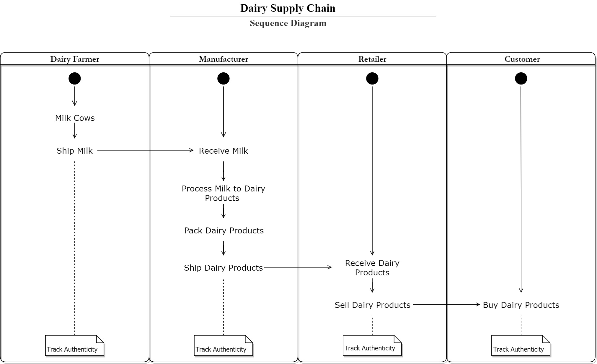
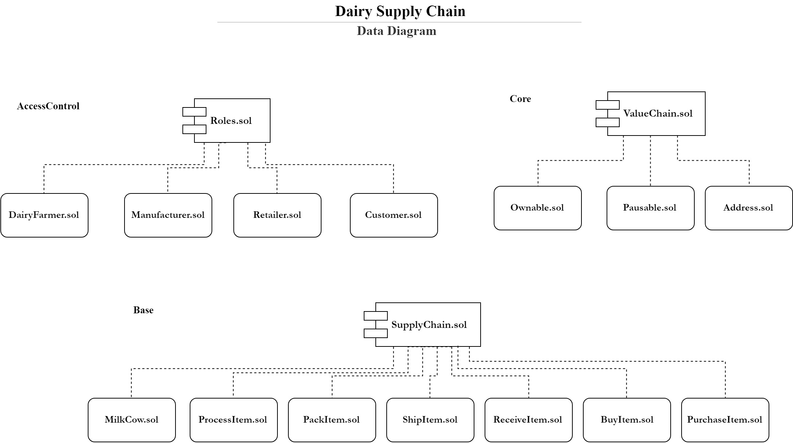
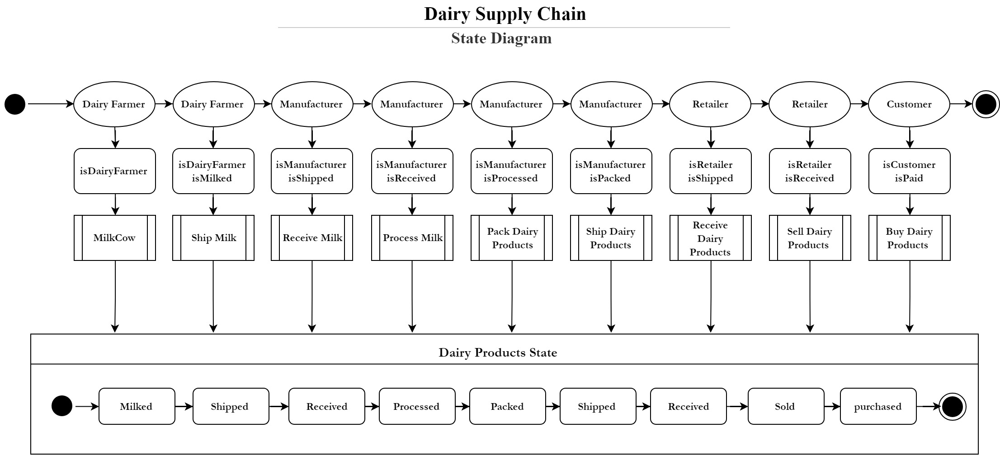
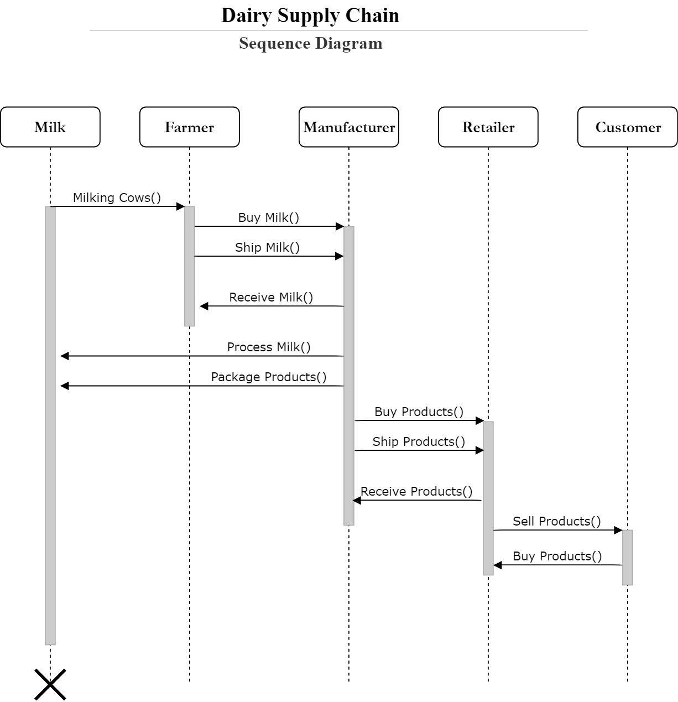

# Dairy Supply Chain
This project provides a blockchain-based supply chain solution for dairy products. That is an application uses the Ethereum blockchain and smart contract functions to store the data and trace the transfer of ownership of dairy products from dairy farms all the way to the end consumer. 

## Part One (Analysis Diagrams Architecture)

### UML Diagrams

* Activity Diagram

* Data Diagram

* State Diagram

* Sequence Diagram

